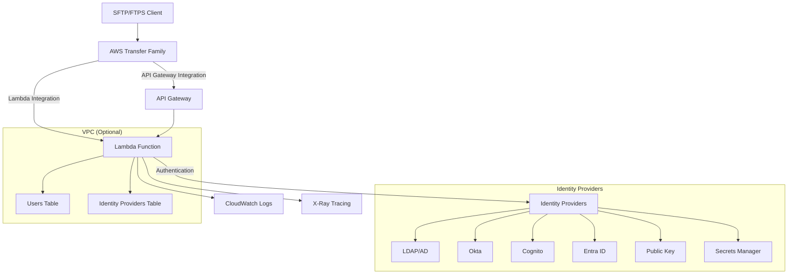

# AWS Transfer Family Custom IdP Terraform Module

[](https://www.terraform.io/)
[](https://aws.amazon.com/)
[](https://github.com/aws/mit-0)

This Terraform module provides a complete, production-ready implementation of the AWS Transfer Family Custom Identity Provider solution. It replaces the original SAM template with native Terraform resources while maintaining full feature parity and adding enterprise-grade capabilities.

## 🚀 Features

### Core Capabilities
- **🔐 Multiple Identity Providers**: LDAP/AD, Okta, Cognito, Entra ID, Public Key, Secrets Manager, Argon2
- **⚙️ Flexible Configuration**: Per-user session settings stored in DynamoDB with granular control
- **🏢 Enterprise Ready**: KMS encryption, X-Ray tracing, VPC integration, monitoring
- **🌐 Dual Integration**: Both Lambda and API Gateway integration options
- **🔧 Pure Terraform**: No CloudFormation or SAM dependencies

### Enterprise Features
- **🔒 Security**: Custom KMS keys, VPC integration, IAM least privilege
- **📊 Monitoring**: CloudWatch alarms, X-Ray tracing, structured logging
- **🔄 High Availability**: Multi-AZ deployment, DynamoDB point-in-time recovery
- **📋 Compliance**: SOC2 ready, comprehensive audit logging
- **🏗️ Scalability**: Auto-scaling DynamoDB, Lambda concurrency controls

## 📖 Table of Contents

- [Quick Start](#-quick-start)
- [Architecture](#-architecture)
- [Usage Examples](#-usage-examples)
- [Configuration](#-configuration)
- [Identity Providers](#-identity-providers)
- [Migration from SAM](#-migration-from-sam)
- [Monitoring & Observability](#-monitoring--observability)
- [Security](#-security)
- [Troubleshooting](#-troubleshooting)
- [Contributing](#-contributing)

## 🚀 Quick Start

### Prerequisites

- AWS CLI configured with appropriate permissions
- Terraform >= 1.0 installed
- VPC with private subnets (for VPC-attached Lambda)
- Security groups configured for Lambda access

### 1. Basic Deployment

```bash
# Clone the module
git clone <repository-url>
cd terraform-aws-transfer-custom-idp

# Create a basic configuration
cat > main.tf << EOF
module "transfer_custom_idp" {
  source = "./terraform-aws-transfer-custom-idp"
  
  name_prefix = "my-transfer-idp"
  use_vpc     = false  # For quick testing
  
  tags = {
    Environment = "development"
    Project     = "file-transfer"
  }
}

# Create Transfer Family server
resource "aws_transfer_server" "example" {
  identity_provider_type = "LAMBDA"
  function              = module.transfer_custom_idp.lambda_function_arn
  protocols             = ["SFTP"]
}
EOF

# Deploy
terraform init
terraform plan
terraform apply
```

### 2. Configure Identity Providers

After deployment, configure your identity providers in DynamoDB:

```bash
# Add a local identity provider
aws dynamodb put-item \
  --table-name "my-transfer-idp-identity-providers" \
  --item '{
    "provider": {"S": "local"},
    "config": {"M": {"type": {"S": "local"}}}
  }'

# Add a test user
aws dynamodb put-item \
  --table-name "my-transfer-idp-users" \
  --item '{
    "user": {"S": "testuser@@local"},
    "identity_provider_key": {"S": "local"},
    "password": {"S": "$argon2id$v=19$m=65536,t=3,p=4$..."},
    "home_directory": {"S": "/my-bucket/testuser"},
    "role": {"S": "arn:aws:iam::123456789012:role/TransferRole"}
  }'
```

## 🏗️ Architecture

### High-Level Architecture



### Component Overview

| Component | Purpose | Integration Type |
|-----------|---------|------------------|
| **Lambda Function** | Core authentication logic | Direct or via API Gateway |
| **DynamoDB Tables** | User and provider configuration | Direct access from Lambda |
| **API Gateway** | REST endpoint for Transfer Family | Optional, enterprise feature |
| **CloudWatch** | Logging and monitoring | Automatic integration |
| **X-Ray** | Distributed tracing | Optional, for debugging |
| **KMS** | Encryption at rest | Optional, enterprise security |

## 💡 Usage Examples

### Basic Example (Development)

```hcl
module "transfer_custom_idp" {
  source = "path/to/terraform-aws-transfer-custom-idp"
  
  name_prefix = "dev-transfer-idp"
  use_vpc     = false  # Lambda runs without VPC
  
  # Basic configuration
  lambda_timeout     = 30
  lambda_memory_size = 512
  log_level         = "DEBUG"
  
  tags = {
    Environment = "development"
    Project     = "file-transfer"
  }
}

# Simple Transfer server
resource "aws_transfer_server" "dev" {
  identity_provider_type = "LAMBDA"
  function              = module.transfer_custom_idp.lambda_function_arn
  protocols             = ["SFTP"]
}
```

### Production Example (VPC + Security)

```hcl
# Data sources for existing infrastructure
data "aws_vpc" "main" {
  tags = { Name = "main-vpc" }
}

data "aws_subnets" "private" {
  filter {
    name   = "vpc-id"
    values = [data.aws_vpc.main.id]
  }
  tags = { Type = "Private" }
}

# Security group for Lambda
resource "aws_security_group" "lambda" {
  name_prefix = "transfer-lambda-"
  vpc_id      = data.aws_vpc.main.id
  
  egress {
    from_port   = 443
    to_port     = 443
    protocol    = "tcp"
    cidr_blocks = ["0.0.0.0/0"]
  }
}

# KMS key for encryption
resource "aws_kms_key" "transfer" {
  description = "Transfer Family Custom IdP encryption key"
  
  policy = jsonencode({
    Version = "2012-10-17"
    Statement = [
      {
        Sid    = "Enable IAM User Permissions"
        Effect = "Allow"
        Principal = { AWS = "arn:aws:iam::${data.aws_caller_identity.current.account_id}:root" }
        Action   = "kms:*"
        Resource = "*"
      }
    ]
  })
}

# Production module configuration
module "transfer_custom_idp" {
  source = "path/to/terraform-aws-transfer-custom-idp"
  
  name_prefix = "prod-transfer-idp"
  
  # VPC Configuration
  use_vpc            = true
  vpc_id             = data.aws_vpc.main.id
  subnet_ids         = data.aws_subnets.private.ids
  security_group_ids = [aws_security_group.lambda.id]
  
  # Performance Configuration
  lambda_timeout     = 60
  lambda_memory_size = 2048
  
  # Enterprise Features
  enable_api_gateway                    = true
  enable_secrets_manager_permissions    = true
  enable_xray_tracing                  = true
  enable_point_in_time_recovery        = true
  
  # Security Configuration
  kms_key_id = aws_kms_key.transfer.arn
  
  # Logging Configuration
  log_level             = "INFO"
  log_retention_in_days = 90
  
  tags = {
    Environment = "production"
    Project     = "file-transfer"
    Compliance  = "SOC2"
  }
}

# Production Transfer server with API Gateway
resource "aws_transfer_server" "prod" {
  identity_provider_type = "API_GATEWAY"
  url                   = module.transfer_custom_idp.api_gateway_url
  invocation_role       = module.transfer_custom_idp.api_gateway_execution_role_arn
  
  protocols            = ["SFTP", "FTPS"]
  security_policy_name = "TransferSecurityPolicy-2023-05"
  
  tags = {
    Environment = "production"
    Integration = "API_Gateway"
  }
}
```

### Multi-Environment Example

```hcl
# Shared configuration
locals {
  environments = {
    dev = {
      vpc_enabled    = false
      memory_size    = 512
      timeout        = 30
      log_level      = "DEBUG"
      retention_days = 7
    }
    staging = {
      vpc_enabled    = true
      memory_size    = 1024
      timeout        = 45
      log_level      = "INFO"
      retention_days = 30
    }
    prod = {
      vpc_enabled    = true
      memory_size    = 2048
      timeout        = 60
      log_level      = "INFO"
      retention_days = 90
    }
  }
}

# Deploy to multiple environments
module "transfer_custom_idp" {
  for_each = local.environments
  source   = "path/to/terraform-aws-transfer-custom-idp"
  
  name_prefix = "${each.key}-transfer-idp"
  
  # Environment-specific configuration
  use_vpc            = each.value.vpc_enabled
  vpc_id             = each.value.vpc_enabled ? data.aws_vpc.main.id : null
  subnet_ids         = each.value.vpc_enabled ? data.aws_subnets.private.ids : []
  security_group_ids = each.value.vpc_enabled ? [aws_security_group.lambda.id] : []
  
  lambda_memory_size    = each.value.memory_size
  lambda_timeout        = each.value.timeout
  log_level            = each.value.log_level
  log_retention_in_days = each.value.retention_days
  
  # Enable enterprise features for production
  enable_api_gateway    = each.key == "prod"
  enable_xray_tracing   = each.key != "dev"
  kms_key_id           = each.key == "prod" ? aws_kms_key.transfer.arn : null
  
  tags = {
    Environment = each.key
    Project     = "file-transfer"
  }
}
```

## ⚙️ Configuration

### Required Variables

| Variable | Description | Example |
|----------|-------------|---------|
| `name_prefix` | Prefix for all resource names | `"my-company-transfer"` |

### VPC Configuration

For production deployments, VPC integration is recommended:

```hcl
# VPC-attached Lambda (recommended)
use_vpc            = true
vpc_id             = "vpc-12345678"
subnet_ids         = ["subnet-12345678", "subnet-87654321"]
security_group_ids = ["sg-12345678"]

# Non-VPC Lambda (development only)
use_vpc = false
```

### Performance Tuning

```hcl
# High-performance configuration
lambda_memory_size = 2048  # MB (128-10240)
lambda_timeout     = 60    # seconds (1-900)

# Cost-optimized configuration
lambda_memory_size = 512
lambda_timeout     = 30
```

### Integration Options

```hcl
# Lambda integration (default)
enable_api_gateway = false

# API Gateway integration (enterprise)
enable_api_gateway = true
```

### Security Configuration

```hcl
# Custom KMS key (use data source to reference existing key)
kms_key_id = data.aws_kms_key.transfer.arn

# Secrets Manager permissions
enable_secrets_manager_permissions = true

# X-Ray tracing
enable_xray_tracing = true
```

### DynamoDB Configuration

```hcl
# Create new tables (default)
existing_users_table_name             = null
existing_identity_providers_table_name = null

# Use existing tables
existing_users_table_name             = "my-existing-users-table"
existing_identity_providers_table_name = "my-existing-providers-table"

# Billing mode
dynamodb_billing_mode = "PAY_PER_REQUEST"  # or "PROVISIONED"
```

## 🔐 Identity Providers

### Supported Identity Providers

| Provider | Authentication Types | MFA Support | Configuration Complexity |
|----------|---------------------|-------------|-------------------------|
| **LDAP/AD** | Password, Certificate | Yes (via LDAP) | Medium |
| **Okta** | SAML, OAuth | Yes (native) | Medium |
| **Cognito** | Password, TOTP | Yes (native) | Low |
| **Entra ID** | OAuth, Certificate | Yes (native) | Medium |
| **Public Key** | SSH Keys | No | Low |
| **Secrets Manager** | Password | No | Low |
| **Argon2** | Password (local) | No | Low |

### LDAP/Active Directory Configuration

```json
{
  "provider": "ldap",
  "config": {
    "server": "ldap.company.com",
    "port": 636,
    "use_ssl": true,
    "base_dn": "ou=users,dc=company,dc=com",
    "bind_dn": "cn=service,ou=services,dc=company,dc=com",
    "bind_password_secret": "arn:aws:secretsmanager:us-east-1:123456789012:secret:ldap-password",
    "user_search_filter": "(sAMAccountName={username})",
    "group_search_filter": "(member={user_dn})",
    "required_groups": ["CN=FileTransferUsers,OU=Groups,DC=company,DC=com"]
  }
}
```

### Okta Configuration

```json
{
  "provider": "okta",
  "config": {
    "org_url": "https://company.okta.com",
    "client_id": "your-client-id",
    "client_secret_arn": "arn:aws:secretsmanager:us-east-1:123456789012:secret:okta-secret",
    "scope": "openid profile groups",
    "required_groups": ["FileTransferUsers"]
  }
}
```

### Cognito Configuration

```json
{
  "provider": "cognito",
  "config": {
    "user_pool_id": "us-east-1_XXXXXXXXX",
    "client_id": "your-cognito-client-id",
    "client_secret_arn": "arn:aws:secretsmanager:us-east-1:123456789012:secret:cognito-secret",
    "required_groups": ["transfer-users"]
  }
}
```

### User Configuration Examples

#### Basic User (Local Authentication)

```json
{
  "user": "john.doe@@local",
  "identity_provider_key": "local",
  "password": "$argon2id$v=19$m=65536,t=3,p=4$...",
  "home_directory": "/my-bucket/users/john.doe",
  "role": "arn:aws:iam::123456789012:role/TransferUserRole"
}
```

#### Enterprise User (LDAP with POSIX)

```json
{
  "user": "john.doe@@ldap",
  "identity_provider_key": "ldap",
  "home_directory": "/efs-mount/users/john.doe",
  "role": "arn:aws:iam::123456789012:role/TransferEnterpriseRole",
  "posix_profile": {
    "uid": 1001,
    "gid": 1001,
    "secondary_gids": [1002, 1003]
  },
  "policy": "{\"Version\":\"2012-10-17\",\"Statement\":[{\"Effect\":\"Allow\",\"Action\":[\"s3:GetObject\",\"s3:PutObject\"],\"Resource\":\"arn:aws:s3:::my-bucket/users/john.doe/*\"}]}"
}
```

## 🔄 Migration from SAM

### Migration Steps

1. **Export existing DynamoDB data:**
   ```bash
   # Export users table
   aws dynamodb scan --table-name YourExistingUsersTable > users-backup.json
   
   # Export identity providers table
   aws dynamodb scan --table-name YourExistingProvidersTable > providers-backup.json
   ```

2. **Deploy Terraform module with existing tables:**
   ```hcl
   module "transfer_custom_idp" {
     source = "path/to/terraform-aws-transfer-custom-idp"
     
     name_prefix = "migrated-transfer-idp"
     
     # Use existing tables during migration
     existing_users_table_name             = "YourExistingUsersTable"
     existing_identity_providers_table_name = "YourExistingProvidersTable"
     
     # Match existing configuration
     use_vpc            = true  # if your SAM deployment used VPC
     vpc_id             = "vpc-existing"
     subnet_ids         = ["subnet-existing1", "subnet-existing2"]
     security_group_ids = ["sg-existing"]
   }
   ```

3. **Update Transfer Family server:**
   ```hcl
   resource "aws_transfer_server" "migrated" {
     identity_provider_type = "LAMBDA"
     function              = module.transfer_custom_idp.lambda_function_arn
     
     # Keep existing server configuration
     protocols = ["SFTP", "FTPS"]
     # ... other existing settings
   }
   ```

4. **Test and validate:**
   ```bash
   # Test authentication with existing users
   sftp existing-user@@provider@your-transfer-endpoint
   ```

5. **Clean up SAM resources:**
   ```bash
   # After successful migration and testing
   sam delete --stack-name your-existing-sam-stack
   ```

### Migration Checklist

- [ ] Export existing DynamoDB table data
- [ ] Deploy Terraform module with existing tables
- [ ] Update Transfer Family server configuration
- [ ] Test authentication with existing users
- [ ] Verify all identity providers work correctly
- [ ] Update monitoring and alerting
- [ ] Clean up old SAM resources

## 📊 Monitoring & Observability

### CloudWatch Metrics

The module automatically creates CloudWatch metrics for:

| Metric | Description | Threshold |
|--------|-------------|-----------|
| `Lambda Errors` | Authentication failures | > 5 errors/5min |
| `Lambda Duration` | Response time | > 30 seconds |
| `DynamoDB Throttles` | Table throttling | > 0 throttles |

### X-Ray Tracing

Enable distributed tracing to debug authentication flows:

```hcl
enable_xray_tracing = true
```

View traces in the AWS X-Ray console to identify:
- Performance bottlenecks
- Error root causes
- Identity provider response times

### Custom Dashboards

Create CloudWatch dashboards for monitoring:

```json
{
  "widgets": [
    {
      "type": "metric",
      "properties": {
        "metrics": [
          ["AWS/Lambda", "Duration", "FunctionName", "your-function-name"],
          ["AWS/Lambda", "Errors", "FunctionName", "your-function-name"],
          ["AWS/Lambda", "Invocations", "FunctionName", "your-function-name"]
        ],
        "period": 300,
        "stat": "Average",
        "region": "us-east-1",
        "title": "Lambda Performance"
      }
    }
  ]
}
```

### Log Analysis

Monitor logs in CloudWatch:

```bash
# View Lambda logs
aws logs filter-log-events \
  --log-group-name "/aws/lambda/your-function-name" \
  --filter-pattern "ERROR"

# View authentication attempts
aws logs filter-log-events \
  --log-group-name "/aws/lambda/your-function-name" \
  --filter-pattern "Authentication"
```

## 🔒 Security

### Network Security

```hcl
# VPC configuration for network isolation
use_vpc            = true
vpc_id             = data.aws_vpc.secure.id
subnet_ids         = data.aws_subnets.private.ids
security_group_ids = [aws_security_group.lambda_restricted.id]

# Security group with minimal access
resource "aws_security_group" "lambda_restricted" {
  name_prefix = "transfer-lambda-restricted-"
  vpc_id      = data.aws_vpc.secure.id
  
  # HTTPS to AWS services
  egress {
    from_port   = 443
    to_port     = 443
    protocol    = "tcp"
    cidr_blocks = ["0.0.0.0/0"]
  }
  
  # LDAPS (if using LDAP)
  egress {
    from_port   = 636
    to_port     = 636
    protocol    = "tcp"
    cidr_blocks = ["10.0.0.0/8"]  # Internal network only
  }
}
```

### Encryption

```hcl
# Custom KMS key with rotation
resource "aws_kms_key" "transfer_security" {
  description             = "Transfer Family Custom IdP encryption"
  deletion_window_in_days = 30
  enable_key_rotation     = true
  
  policy = jsonencode({
    Version = "2012-10-17"
    Statement = [
      {
        Sid    = "Enable IAM User Permissions"
        Effect = "Allow"
        Principal = { AWS = "arn:aws:iam::${data.aws_caller_identity.current.account_id}:root" }
        Action   = "kms:*"
        Resource = "*"
      },
      {
        Sid    = "Allow CloudWatch Logs"
        Effect = "Allow"
        Principal = { Service = "logs.amazonaws.com" }
        Action = [
          "kms:Encrypt",
          "kms:Decrypt",
          "kms:ReEncrypt*",
          "kms:GenerateDataKey*",
          "kms:DescribeKey"
        ]
        Resource = "*"
      }
    ]
  })
}

# Use KMS key in module
module "transfer_custom_idp" {
  # ... other configuration
  kms_key_id = aws_kms_key.transfer_security.arn
}
```

### IAM Best Practices

The module follows IAM least privilege principles:

- Lambda execution role has minimal required permissions
- DynamoDB access limited to specific tables and actions
- Secrets Manager access only when explicitly enabled
- VPC permissions only when VPC is enabled

### Secrets Management

Store sensitive credentials in AWS Secrets Manager:

```bash
# Store LDAP bind password
aws secretsmanager create-secret \
  --name "transfer-ldap-bind-password" \
  --description "LDAP bind password for Transfer Family" \
  --secret-string "your-secure-password"

# Store Okta client secret
aws secretsmanager create-secret \
  --name "transfer-okta-client-secret" \
  --description "Okta client secret for Transfer Family" \
  --secret-string "your-okta-client-secret"
```

## 🔧 Troubleshooting

### Common Issues

#### 1. Lambda Timeout Errors

**Symptoms:**
- Authentication requests timing out
- CloudWatch logs show timeout errors

**Solutions:**
```hcl
# Increase timeout
lambda_timeout = 60  # seconds

# Increase memory (improves CPU performance)
lambda_memory_size = 2048  # MB
```

#### 2. VPC Connectivity Issues

**Symptoms:**
- Lambda cannot reach DynamoDB
- Identity provider connections fail

**Solutions:**
```hcl
# Ensure NAT Gateway or VPC endpoints exist
# Check security group rules
resource "aws_security_group_rule" "lambda_https" {
  type              = "egress"
  from_port         = 443
  to_port           = 443
  protocol          = "tcp"
  cidr_blocks       = ["0.0.0.0/0"]
  security_group_id = aws_security_group.lambda.id
}

# Add VPC endpoints for AWS services
resource "aws_vpc_endpoint" "dynamodb" {
  vpc_id       = data.aws_vpc.main.id
  service_name = "com.amazonaws.${data.aws_region.current.name}.dynamodb"
}
```

#### 3. DynamoDB Permission Errors

**Symptoms:**
- "AccessDeniedException" in Lambda logs
- Users cannot authenticate

**Solutions:**
```bash
# Check table names match module outputs
terraform output users_table_name
terraform output identity_providers_table_name

# Verify IAM permissions in AWS console
# Check KMS key permissions if using custom key
```

#### 4. Identity Provider Connection Failures

**Symptoms:**
- LDAP/Okta authentication fails
- "Connection timeout" errors

**Solutions:**
```hcl
# For LDAP: Check network connectivity
# Ensure security groups allow LDAP/LDAPS ports
resource "aws_security_group_rule" "ldap" {
  type              = "egress"
  from_port         = 636  # LDAPS
  to_port           = 636
  protocol          = "tcp"
  cidr_blocks       = ["10.0.0.0/8"]  # Your network
  security_group_id = aws_security_group.lambda.id
}

# For Okta: Verify client credentials
# Check Secrets Manager secret values
```

### Debugging Steps

1. **Check CloudWatch Logs:**
   ```bash
   aws logs filter-log-events \
     --log-group-name "/aws/lambda/your-function-name" \
     --start-time $(date -d '1 hour ago' +%s)000
   ```

2. **Test Lambda Function Directly:**
   ```bash
   aws lambda invoke \
     --function-name "your-function-name" \
     --payload '{"username":"testuser@@local","password":"testpass","protocol":"SFTP","sourceIp":"1.2.3.4"}' \
     response.json
   ```

3. **Verify DynamoDB Configuration:**
   ```bash
   # Check identity provider configuration
   aws dynamodb get-item \
     --table-name "your-providers-table" \
     --key '{"provider":{"S":"local"}}'
   
   # Check user configuration
   aws dynamodb get-item \
     --table-name "your-users-table" \
     --key '{"user":{"S":"testuser@@local"},"identity_provider_key":{"S":"local"}}'
   ```

4. **Use X-Ray for Tracing:**
   - Enable X-Ray tracing in module configuration
   - View traces in AWS X-Ray console
   - Identify performance bottlenecks and errors

### Performance Optimization

#### Lambda Performance

```hcl
# Optimize for high throughput
lambda_memory_size = 2048  # More memory = more CPU
lambda_timeout     = 60    # Adequate timeout

# Enable provisioned concurrency for consistent performance
resource "aws_lambda_provisioned_concurrency_config" "transfer_idp" {
  function_name                     = module.transfer_custom_idp.lambda_function_name
  provisioned_concurrent_executions = 10
  qualifier                        = "$LATEST"
}
```

#### DynamoDB Performance

```hcl
# Use on-demand billing for variable workloads
dynamodb_billing_mode = "PAY_PER_REQUEST"

# Or use provisioned mode for predictable workloads
dynamodb_billing_mode = "PROVISIONED"

# Enable DynamoDB Accelerator (DAX) for microsecond latency
resource "aws_dax_cluster" "transfer_cache" {
  cluster_name       = "${var.name_prefix}-dax"
  iam_role_arn      = aws_iam_role.dax.arn
  node_type         = "dax.t3.small"
  replication_factor = 1
  
  subnet_group_name = aws_dax_subnet_group.transfer.name
  security_group_ids = [aws_security_group.dax.id]
}
```

## 🤝 Contributing

We welcome contributions! Please see our [Contributing Guide](CONTRIBUTING.md) for details.

### Development Setup

```bash
# Clone the repository
git clone <repository-url>
cd terraform-aws-transfer-custom-idp

# Install pre-commit hooks
pre-commit install

# Run tests
terraform fmt -check
terraform validate
tflint
```

### Submitting Changes

1. Fork the repository
2. Create a feature branch
3. Make your changes
4. Add tests if applicable
5. Submit a pull request

## Requirements

| Name | Version |
|------|---------|
| terraform | >= 1.0 |
| aws | >= 5.0 |
| archive | >= 2.0 |

## Providers

| Name | Version |
|------|---------|
| aws | >= 5.0 |
| archive | >= 2.0 |

## Inputs

| Name | Description | Type | Default | Required |
|------|-------------|------|---------|:--------:|
| name_prefix | Prefix for all resource names | `string` | n/a | yes |
| use_vpc | Whether to attach Lambda function to VPC | `bool` | `true` | no |
| vpc_id | VPC ID where Lambda function will be deployed | `string` | `null` | no |
| subnet_ids | List of subnet IDs for Lambda function | `list(string)` | `[]` | no |
| security_group_ids | List of security group IDs for Lambda function | `list(string)` | `[]` | no |
| lambda_timeout | Lambda function timeout in seconds | `number` | `45` | no |
| lambda_memory_size | Lambda function memory size in MB | `number` | `1024` | no |
| user_name_delimiter | Delimiter for username and identity provider | `string` | `"@@"` | no |
| enable_api_gateway | Whether to create API Gateway for REST-based integration | `bool` | `false` | no |
| enable_secrets_manager_permissions | Whether to grant Secrets Manager permissions to Lambda | `bool` | `false` | no |
| enable_xray_tracing | Whether to enable X-Ray tracing | `bool` | `false` | no |
| existing_users_table_name | Name of existing DynamoDB users table | `string` | `null` | no |
| existing_identity_providers_table_name | Name of existing DynamoDB identity providers table | `string` | `null` | no |
| dynamodb_billing_mode | DynamoDB billing mode | `string` | `"PAY_PER_REQUEST"` | no |
| kms_key_id | KMS key ID for encryption | `string` | `null` | no |
| enable_point_in_time_recovery | Whether to enable point-in-time recovery for DynamoDB tables | `bool` | `true` | no |
| log_level | Lambda function log level | `string` | `"INFO"` | no |
| log_retention_in_days | CloudWatch log retention in days | `number` | `14` | no |
| tags | Tags to apply to all resources | `map(string)` | `{}` | no |

## Outputs

| Name | Description |
|------|-------------|
| lambda_function_arn | ARN of the IdP handler Lambda function |
| lambda_function_name | Name of the IdP handler Lambda function |
| lambda_function_invoke_arn | Invoke ARN of the IdP handler Lambda function |
| lambda_layer_arn | ARN of the Lambda layer |
| users_table_name | Name of the users DynamoDB table |
| users_table_arn | ARN of the users DynamoDB table |
| identity_providers_table_name | Name of the identity providers DynamoDB table |
| identity_providers_table_arn | ARN of the identity providers DynamoDB table |
| api_gateway_url | URL of the API Gateway (if enabled) |
| api_gateway_execution_role_arn | ARN of the API Gateway execution role (if enabled) |
| lambda_log_group_name | Name of the Lambda function CloudWatch log group |
| lambda_log_group_arn | ARN of the Lambda function CloudWatch log group |

## Architecture

This module creates the following AWS resources:

- **AWS Lambda Function**: Handles identity provider authentication logic
- **AWS Lambda Layer**: Contains Python dependencies for the Lambda function
- **DynamoDB Tables**: Store user and identity provider configurations
- **IAM Roles and Policies**: Provide necessary permissions for Lambda execution
- **CloudWatch Log Group**: Centralized logging for the Lambda function
- **API Gateway** (optional): REST API endpoint for AWS Transfer Family integration

## Identity Provider Modules

The solution supports the following identity provider modules:

- **LDAP/Active Directory**: Enterprise directory integration with group membership support
- **Okta**: SAML/OAuth integration with MFA support
- **AWS Cognito**: Native AWS identity provider with TOTP MFA
- **Microsoft Entra ID**: Azure Active Directory integration (Beta)
- **Public Key**: SSH key-based authentication
- **AWS Secrets Manager**: Credential storage integration
- **Argon2**: Local password hashing for simple use cases

## License

This module is licensed under the MIT-0 License. See the LICENSE file for details.